# Pangolin-Database-App

This program was specially developed for an animal welfare organization in order to clearly save data on the animal pangolin and to collaborate with various doctors. We hope that it can also help further. 

## Installation
To use this application you need a MySQL-Server. You can also work with this application offline and synchronize your data later.

## Table of content

- [Preview](#preview)
- [Stats](#stats)
- [Clone](#clone)
- [License](#License)
- [Pictures](#Pictures)

## Preview


## Stats


## Clone

> You need Visual Studio 2019

- Enter the following command
  
  ```shell
  $ git clone https://github.com/CodingTarik/Pangolin-Database-App.git
  ```

## License

## Pictures
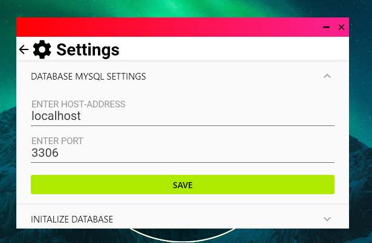
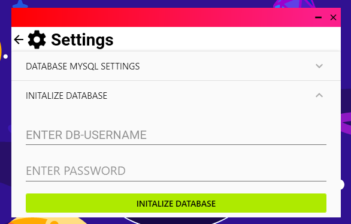
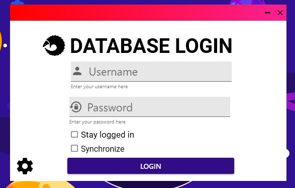
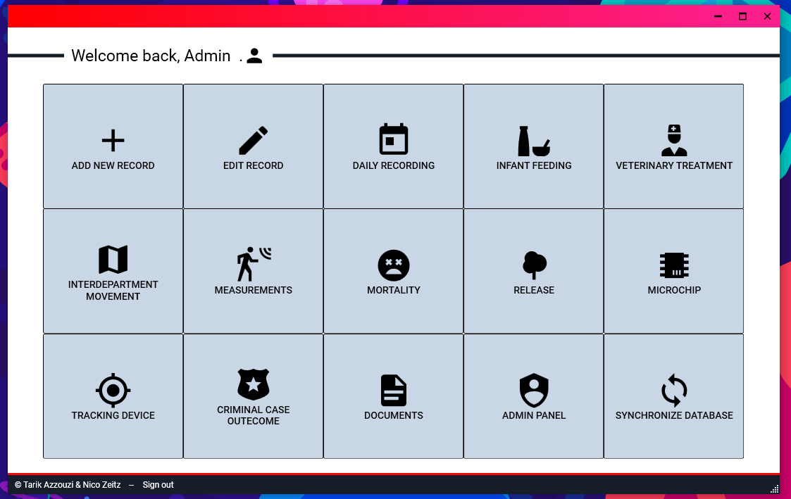
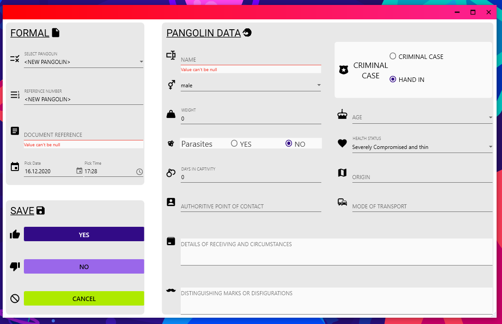
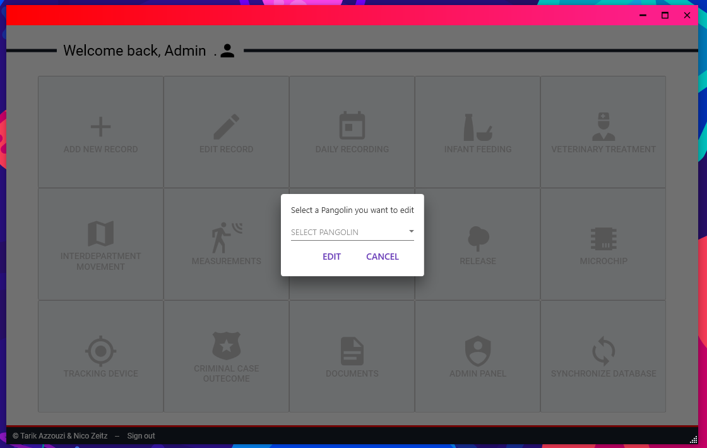
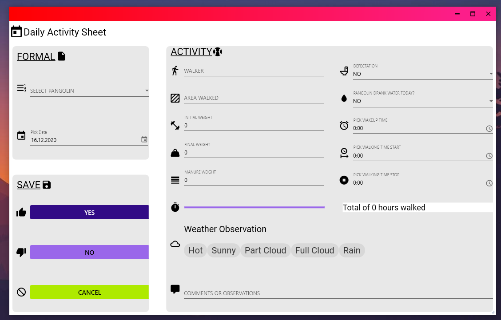
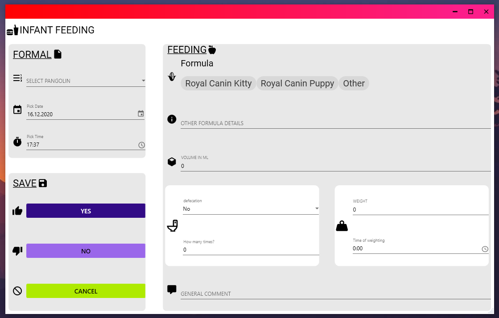
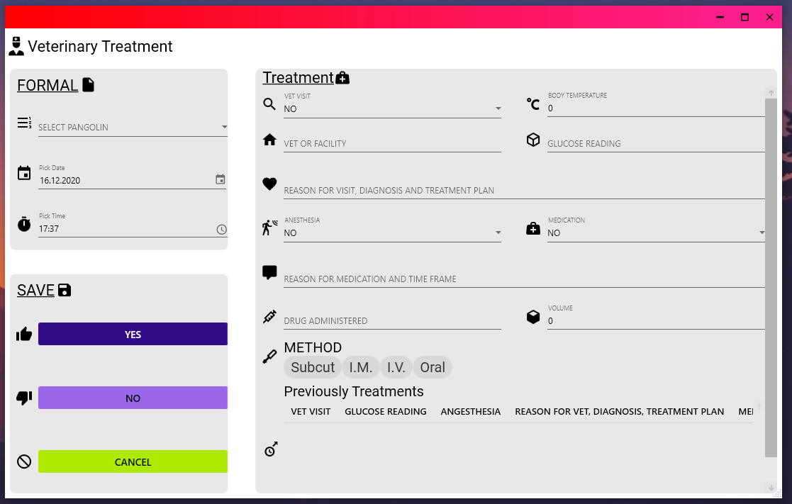
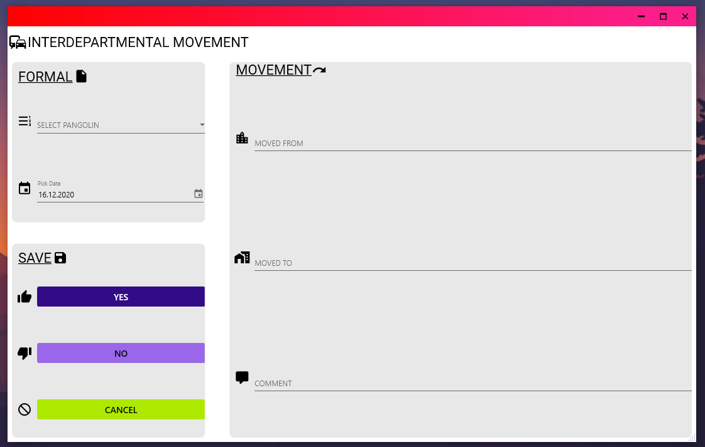
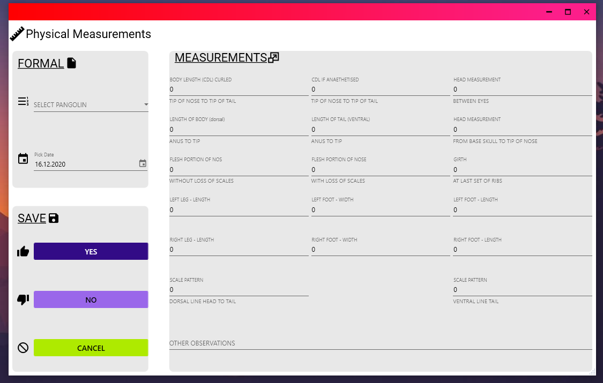
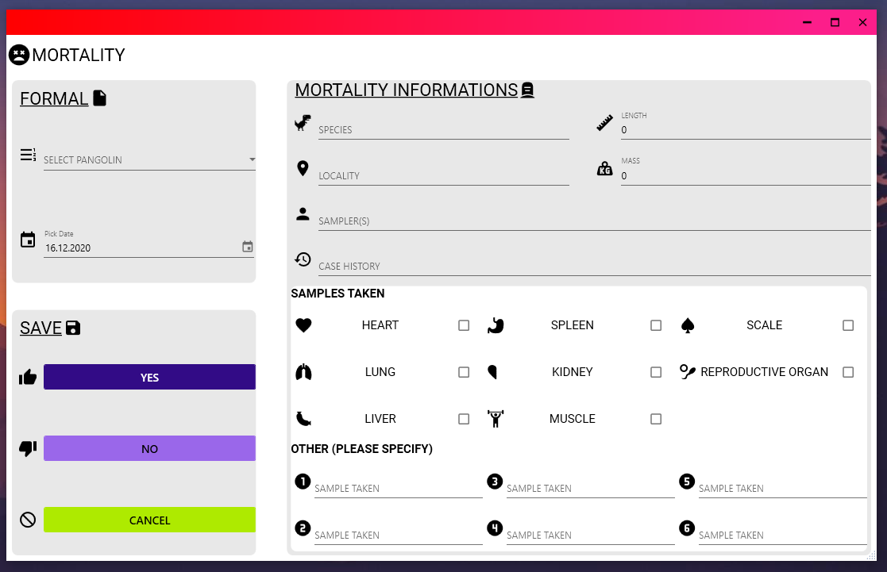
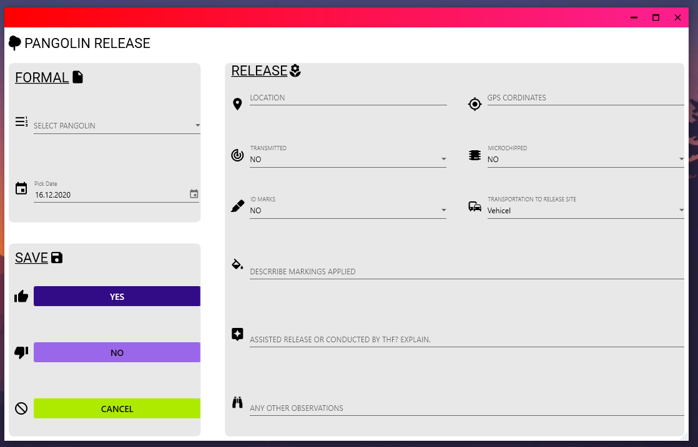
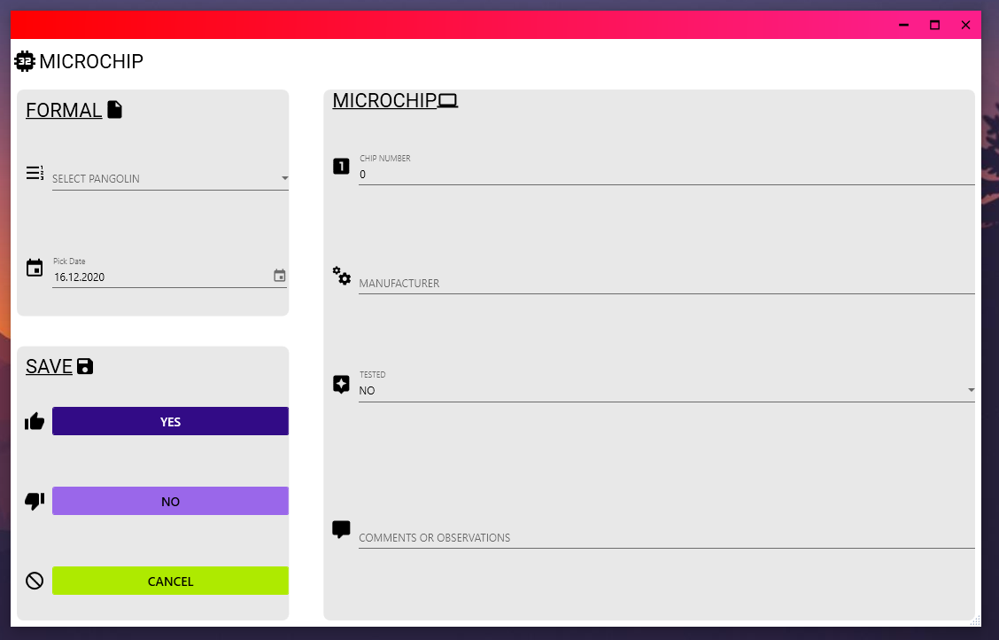
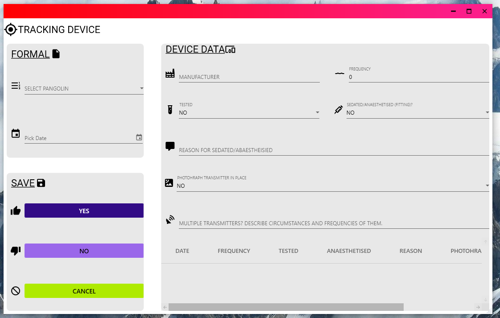
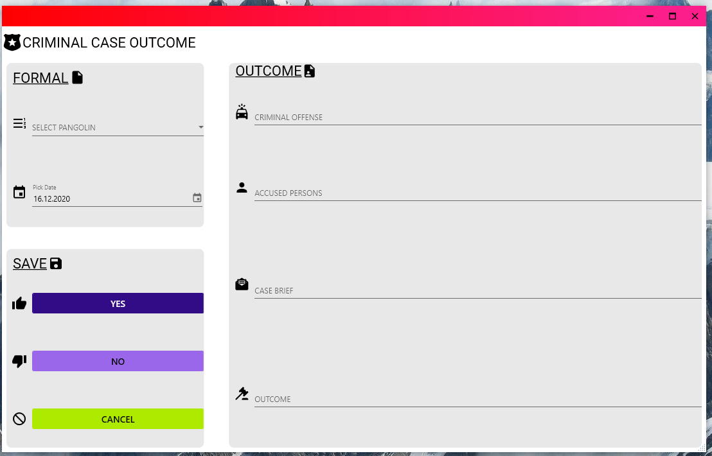
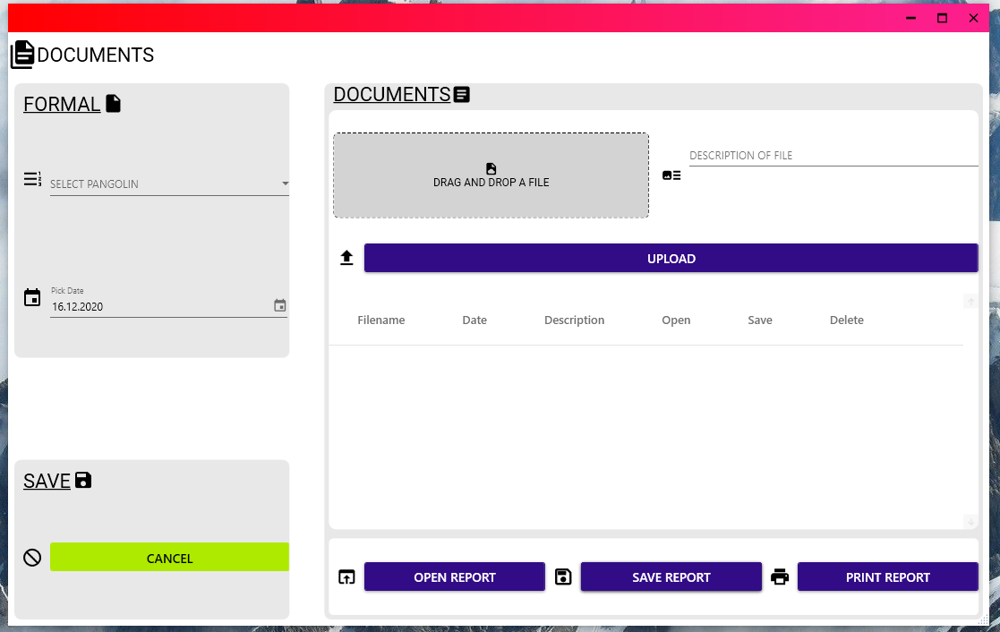
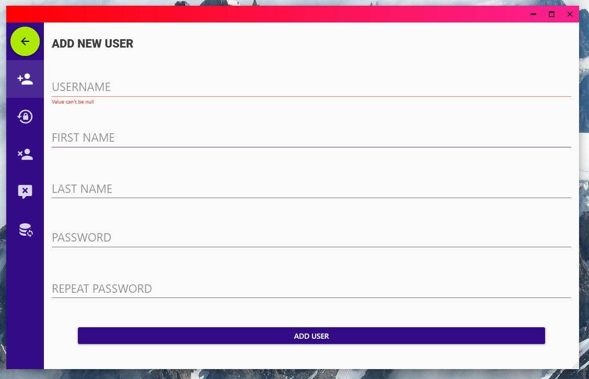

